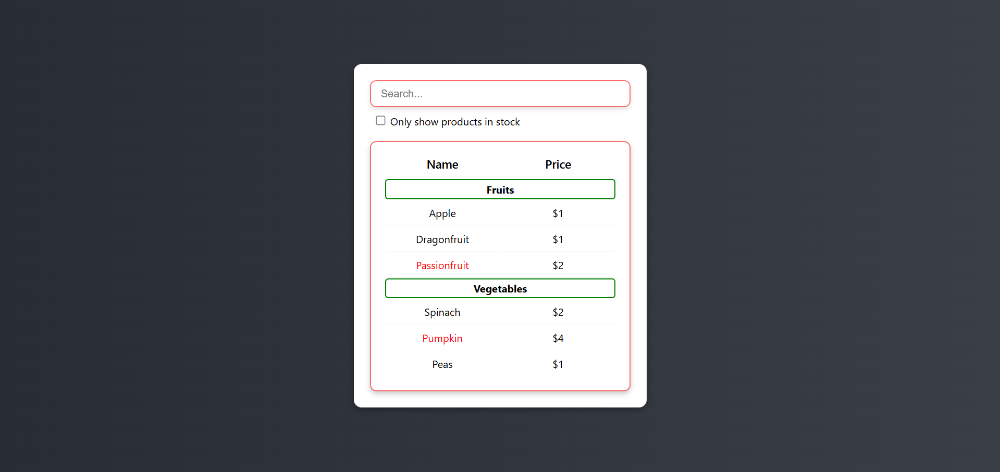

# 🛒 Filterable Product Table (React.js)

A simple and **fully responsive** product table built using **React.js**. This project allows users to filter products by name and stock availability. It is inspired by the [React Docs](https://react.dev/) and helped me understand UI structuring and component-based development.

---

## 📸 Screenshot


---

## 🚀 Live Demo

Check out the live version of the project here: **[Product-table](https://product-table-gamma.vercel.app/)**  

---

## 🎯 Features
✅ Search products by name  
✅ Filter only in-stock products  
✅ Categorized product listing  
✅ Clean and interactive UI  
✅ Fully responsive design  

---

## 🛠 Technologies Used
- **React.js**
- **CSS (Flexbox, Grid)**
- **Hooks (useState)**
- **JSX**
  
---

## 📖 What I Learned  
This project helped me understand:  
- Component-based development in React  
- Props and state management  
- Event handling in React  
- Filtering data dynamically  
- Building a clean and user-friendly UI  

---

## 🚧 Future Improvements  
🔹 UI enhancements (better styling, animations)  
🔹 Add sorting feature  
🔹 Improve accessibility  

---

## 💻 Setup Instructions

1⃣ Clone the repository:

```bash
git clone https://github.com/yourusername/filterable-product-table.git
```

2⃣ Navigate to the project directory:

```bash
cd filterable-product-table
```

3⃣ Install dependencies:

```bash
npm install
```

4⃣ Run the development server:

```bash
npm start
```

The app will be running on `http://localhost:3000`

---

## 🎯 Contributing

Feel free to fork this repository and open a pull request with improvements! 🚀
